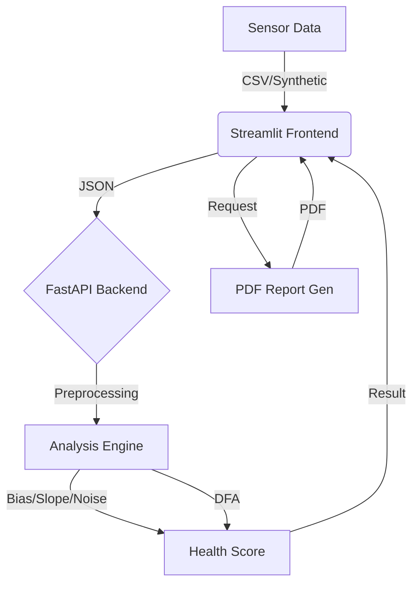

# QorSense v1 - Industrial Process Sensor Monitoring

QorSense v1 is a "demo-ready" predictive maintenance application designed to monitor industrial sensor data (Flow, Pressure, Temperature). It utilizes a FastAPI backend for advanced mathematical analysis and a Streamlit frontend for an interactive, professional dashboard.

## 🏗 Architecture

The project follows a monorepo structure:

- **backend/**: Contains the calculation engine and API.
  - `main.py`: FastAPI application serving endpoints for analysis and synthetic data.
  - `analysis.py`: Core logic for calculating Bias, Slope, Noise, Hysteresis, and DFA (Detrended Fluctuation Analysis).
  - `report_gen.py`: Generates professional PDF reports with trend charts.
  - `models.py`: Pydantic models for data validation.
- **frontend/**: Streamlit dashboard.
  - `app.py`: Main application file with a custom "Dark Industrial" theme.
- **scripts**:
  - `run_demo.sh`: One-click script to launch both backend and frontend.

### System Diagram



## 🚀 Getting Started

### Prerequisites
- Python 3.9+
- pip

### Installation

1.  Clone the repository or download the source code.
2.  Install the required dependencies:
    ```bash
    pip install -r requirements.txt
    ```
    *Note: On managed Python environments (like recent macOS versions), you might need to use:*
    ```bash
    pip install -r requirements.txt --break-system-packages
    ```

### Running the Demo

You can use the provided Makefile for convenience:

```bash
make run
```

Or manually:

```bash
chmod +x run_demo.sh
./run_demo.sh
```

This will:
1.  Start the FastAPI backend on `http://localhost:8000`.
2.  Launch the Streamlit dashboard in your default browser (usually `http://localhost:8501`).

### Testing

Run the unit tests to verify the calculation engine:

```bash
make test
```

## 🖥 Features

1.  **Data Sources**:
    - **Synthetic Data Generator**: Simulate "Normal", "Drifting" (gradual failure), "Noisy" (degradation), or "Oscillation" (instability) sensor behavior.
    - **CSV Upload**: Analyze your own time-series data. Supports automatic column detection and manual selection.

2.  **Advanced Analysis**:
    - **Health Score**: A weighted 0-100 score indicating sensor health.
    - **Bias**: Offset from the reference baseline.
    - **Slope**: Linear trend detection (drift).
    - **Noise (SNR)**: Signal-to-Noise ratio and Standard Deviation.
    - **DFA (Hurst Exponent)**: Detects long-term memory/persistence in the signal (crucial for early drift detection).

3.  **Reporting**:
    - **PDF Export**: Generate a downloadable PDF report containing all metrics, an AI-driven diagnosis, and a snapshot of the data trend.

4.  **Customization**:
    - **Window Size**: Adjust the smoothing window for analysis via the sidebar.

## 🎨 Design

The dashboard features a custom "Dark Industrial" aesthetic with:
- High-contrast metric cards.
- Interactive Plotly charts.
- Responsive layout.

## 🛠 Troubleshooting

- **PDF Generation Fails**: Ensure `kaleido` is installed correctly (`pip install kaleido`). On some Linux systems, you might need additional libraries for static image generation.
- **Connection Error**: If the frontend says "Connection Error", make sure the backend is running on port 8000. Check the terminal output for errors.

## 📄 License

Proprietary - QorSense Technologies.
